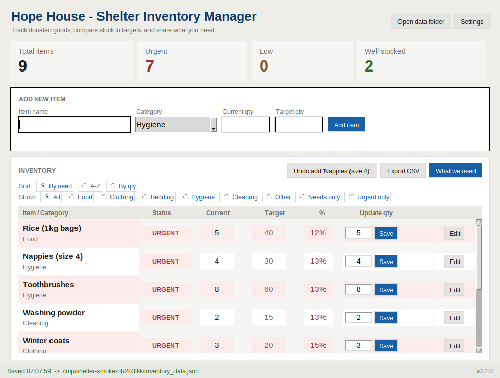
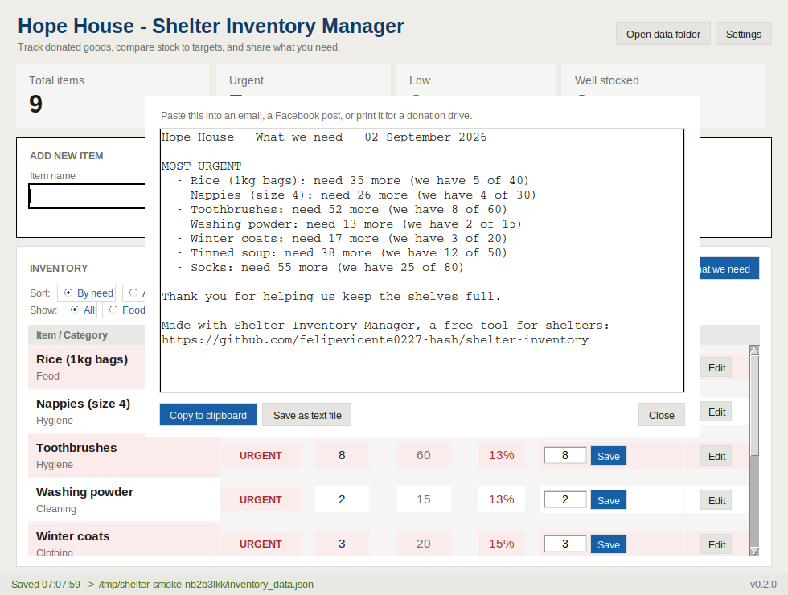

# Shelter Inventory Manager

A free, simple program for shelters, food banks and small charities that keep
track of donated goods on paper or in their heads. It shows what you have, what
you are running out of, and gives you a ready-to-share **"What we need"** list
for donors. Everything stays on your own computer.



The **What we need** button turns the red and amber rows into a list you can
paste anywhere:



---

## For charities: get it running in 2 minutes

**Windows**

1. Go to the [Releases page](https://github.com/felipevicente0227-hash/shelter-inventory/releases/latest)
   and download `ShelterInventory.exe`.
2. Double-click it. The first time, Windows may show a blue box saying
   *"Windows protected your PC"*. Click **More info**, then **Run anyway**.
   (That warning appears for any small free program that has not paid for a
   code-signing certificate. The program is open source - anyone can read
   exactly what it does in this repository.)
3. Type your charity's name when asked. Choose whether to start with a few
   example items. That is it.

**Mac**

1. Download `ShelterInventory-mac.zip` from the same page and unzip it.
2. Right-click `ShelterInventory` → **Open** → **Open** (only needed the first time).

**No download at all (any computer with Python)**

Download this repository, then double-click `RUN APP (double-click me).cmd`
on Windows, or run `python3 shelter_inventory.py` on Mac/Linux.

### Using it

- **Add an item**: type the name, pick a category, enter what you have now and
  what you would like to have (the *target*), press **Add item** or Enter.
- **Update stock**: change the number in the *Update qty* box and press **Save**.
- **Edit / rename / delete**: press **Edit** on the row. Delete asks you first,
  and the **Undo** button brings back anything you change by mistake.
- **Colours**: red **URGENT** = below 50% of target, amber **LOW** = below 80%,
  green **OK** = 80% or more. You can change those two numbers in **Settings**.
- **What we need**: one button gives you a plain-text list of everything
  urgent or low, most-needed first. Copy it into an email, a Facebook post,
  or print it for a donation drive.
- **Export CSV**: the whole inventory as a spreadsheet file that opens in Excel.
- **Settings**: your charity's name, your own categories (one per line), the
  colour thresholds, and a button to load the example items.

### Where your data lives (please read this once)

Your inventory is saved automatically after every change, to a normal folder
you can see and back up:

| Computer | Folder |
|---|---|
| Windows | `C:\Users\<you>\Documents\ShelterInventory\` |
| Mac | `/Users/<you>/Documents/ShelterInventory/` |
| Linux | `~/Documents/ShelterInventory/` |

The **Open data folder** button in the app takes you straight there. Inside:

| File | What it is |
|---|---|
| `inventory_data.json` | your items - plain text, readable by any program |
| `inventory_data.bak` | the version before your last change |
| `backups/inventory_data-YYYY-MM-DD.json` | one copy per day, the last 30 days |
| `settings.json` | your charity name, categories and thresholds |
| `log.txt` | anything that went wrong, for troubleshooting |

**Your data is yours.** It is never uploaded anywhere, there is no account,
and the program does not use the internet. If this project disappeared
tomorrow, your `inventory_data.json` would still open in Notepad.

**To back up**: copy the `ShelterInventory` folder to a USB stick or cloud
drive. To move to a new computer, copy it into the new computer's Documents.

**Portable mode**: create a folder called `data` next to `ShelterInventory.exe`
(for example on a USB stick) and the app will keep everything in there instead.

### If something goes wrong

- **"Windows protected your PC"** - click *More info* → *Run anyway*. See above.
- **"YOUR LAST CHANGE WAS NOT SAVED"** - the program could not write to the
  data folder (usually a permissions problem, a full disk, or a cloud-drive
  folder that is locked). Your change is still on screen; use *Export CSV* to
  keep a copy, then check the folder shown in the message.
- **"Recovered from backup"** - the data file was damaged (power cut mid-save,
  disk error) and the previous good copy was loaded. The damaged file is kept
  in the data folder with `corrupt` in its name, in case anything is missing.
- **Items from an older version are missing** - the very first version saved
  its file wherever it was started from. On first run the new version looks
  for that file and offers to import it. If it did not find it, search your
  computer for `inventory_data.json`, copy that file into the data folder
  (replacing the one there), and restart the app.

Questions or ideas: open an issue on this repository.

---

## For developers

Pure Python 3, standard library only (tkinter). No packages to install.

```
python tests.py            # 35 tests, no window, nothing outside a temp folder
python shelter_inventory.py
```

| File | What it does |
|---|---|
| `inventory_core.py` | Data folder, safe saving, backups, undo, the urgent/low/ok logic, CSV and needs-list exports. No GUI code. |
| `shelter_inventory.py` | The tkinter window. Only calls into the core. |
| `tests.py` | Tests for the core. |
| `dev/smoke_gui.py` | Drives the real window under `xvfb` for a screenshot and a crash check. |
| `BUILD EXE (double-click me).cmd` | Runs the tests, then builds `dist\ShelterInventory.exe` with PyInstaller. |
| `.github/workflows/build.yml` | Builds Windows and Mac downloads on GitHub and attaches them to a Release when you push a tag like `v0.2.1`. |

### How saving works (the bug v0.1 had)

v0.1 used `DATA_FILE = "inventory_data.json"` - a bare file name, which means
*"the folder the program was started from"*. Start it from PowerShell, from
VS Code, or by double-clicking and you get three different folders, so edits
seemed to vanish. Errors inside button handlers were printed to a console
nobody could see.

v0.2:

1. `inventory_core.data_folder()` picks one fixed folder per computer
   (Documents/ShelterInventory, found via the Windows shell so OneDrive
   redirection is respected).
2. `Store.save()` writes to a `.tmp` file, copies the current file to `.bak`,
   takes a dated backup once a day, then swaps the `.tmp` into place with
   `os.replace()` - one atomic step, so a crash leaves a complete file either way.
3. A failed save raises `StoreError`; the window shows it in the status bar
   **and** a message box, and writes the traceback to `log.txt`.
4. A corrupt file falls back to `.bak`; if both are unreadable the app refuses
   to start rather than overwrite anything.

### Releasing a new version

1. Bump `APP_VERSION` in `inventory_core.py`.
2. `git tag v0.2.1 && git push --tags`
3. GitHub builds the `.exe` and the Mac zip and attaches them to the Release.

### Design rules

- One charity, one computer, one folder. No server, no accounts, no internet.
- Never lose data silently. Every failure is visible; every change is undoable.
- Plain text formats only (JSON, CSV, TXT) so the data outlives the program.

License: MIT - free for anyone, forever.
